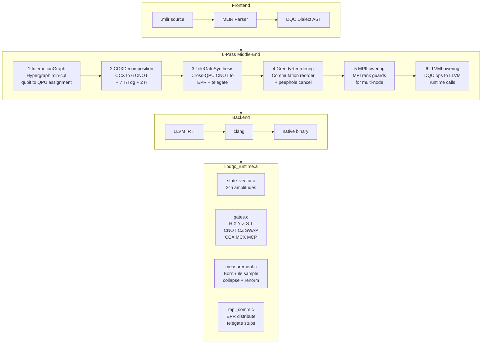
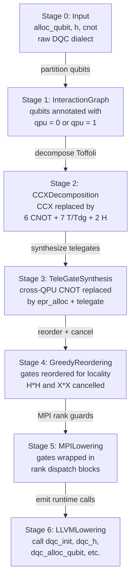
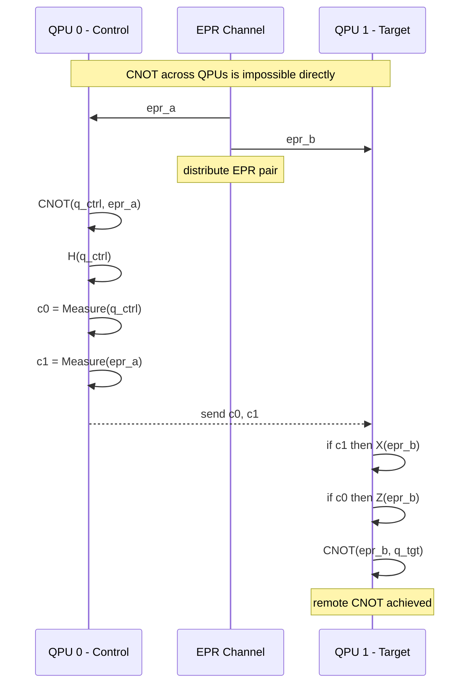
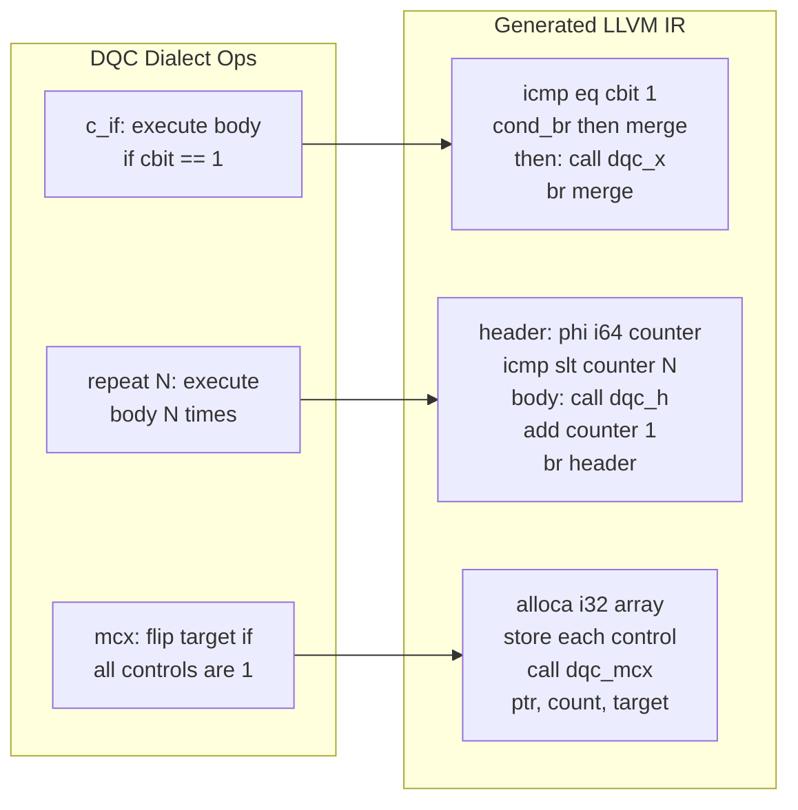
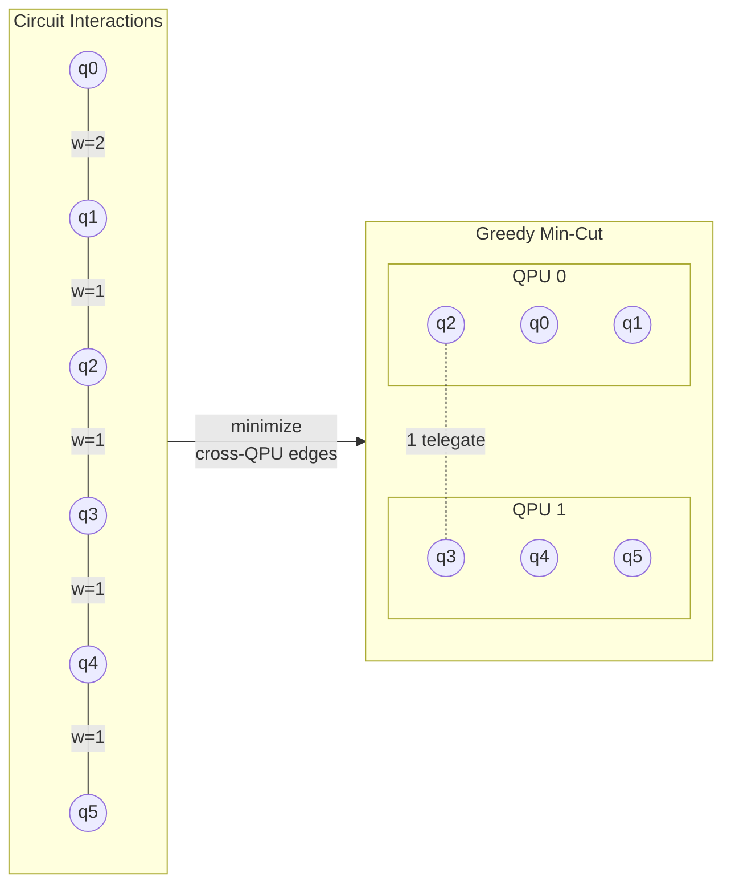
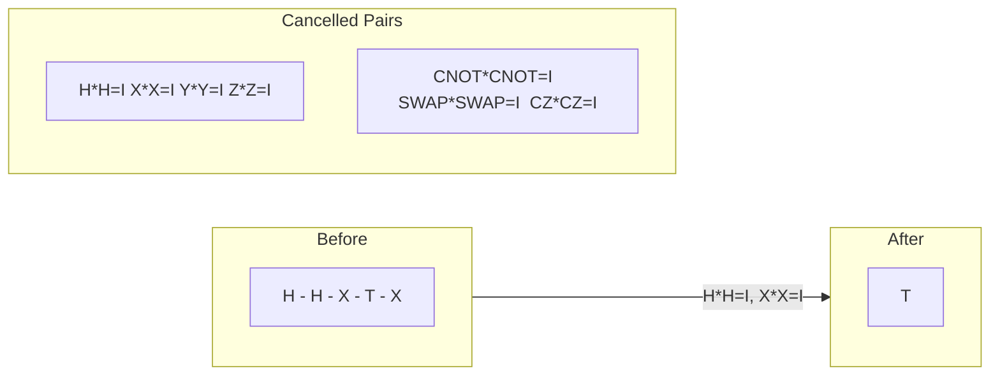
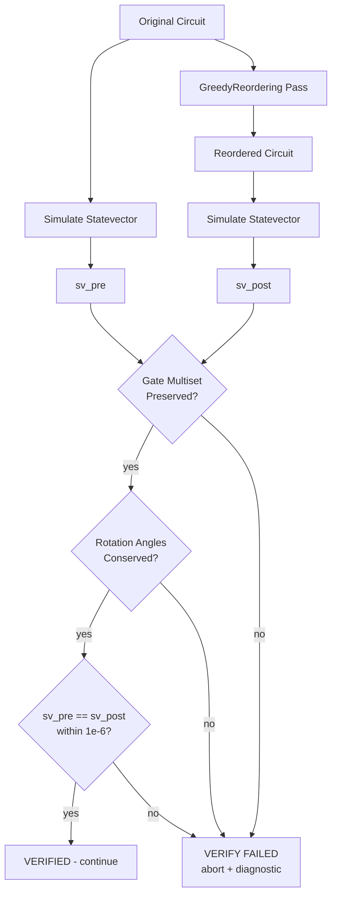
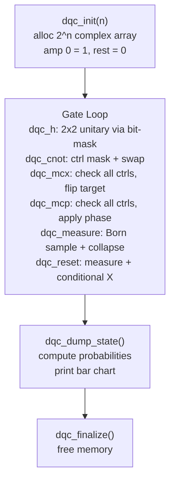

DQC — Distributed Quantum Compiler
====================================

A 6-pass quantum compiler on MLIR/LLVM that partitions circuits across QPUs, synthesizes teleportation-based remote gates over EPR channels, and lowers to native executables through statevector simulation.

> **6,200+ lines** | **6 compiler passes** | **20+ quantum ops** | **14 demo circuits** | **8 verified benchmarks**

---

Why Distributed Quantum Computing Matters
------------------------------------------

### The Scalability Wall

Every major quantum hardware platform — superconducting (IBM, Google), trapped-ion (IonQ, Quantinuum), neutral-atom (QuEra, Atom Computing), photonic (PsiQuantum, Xanadu) — hits the same wall: **single-chip qubit counts cannot scale indefinitely**. Decoherence, crosstalk, and fabrication yield degrade exponentially as chips grow. The consensus across industry and academia is that useful fault-tolerant quantum computers will be **modular and networked**, not monolithic.

### Industry Direction

| Company | Approach | Timeline |
|---------|----------|----------|
| **IBM** | Flamingo inter-chip coupling (Heron R2 via meter-long superconducting links), Quantum Networking Unit (QNU) for photonic interconnect, Starling fault-tolerant networked system | Cockatoo 2027, Starling 2029 |
| **IBM + Cisco** | Joint development of transducers and optical links connecting QPUs across data centers and kilometer-scale distances | Announced Nov 2025 |
| **Atom Computing + Cisco** | MoU to link neutral-atom processors through quantum networks for distributed architectures | March 2026 |
| **IonQ** | Photonic interconnects for multi-QPU entanglement, acquired Qubitekk for quantum networking | 1000+ logical qubits by 2028 |
| **PsiQuantum** | Million-qubit photonic machine leveraging telecom fiber infrastructure, DARPA US2QC Phase 3 | ~2028 |
| **QuEra** | Multi-core neutral-atom architecture, demonstrated 200-ion linear chain | Modular networking ~2030 |
| **Infleqtion** | Neutral-atom QPUs with photonic interconnects for distributed operation | Active development |

Every roadmap converges on the same architecture: **multiple QPUs connected by entanglement channels**. The hardware is being built. What's missing is the compiler stack that takes a quantum circuit written for a single machine and automatically distributes it across a network of QPUs — minimizing the entanglement cost, scheduling remote operations, and lowering the result to executable code.

**That is what DQC does.**

### Academic Foundations

DQC implements techniques from active research in distributed quantum compilation:

| Technique in DQC | Based On | Reference |
|-------------------|----------|-----------|
| Hypergraph min-cut partitioning | Automated distribution of quantum circuits via hypergraph partitioning | Andres-Martinez & Heunen, [arXiv:1811.10972](https://arxiv.org/abs/1811.10972) |
| Teleportation-based remote CNOT | Optimal local implementation of nonlocal quantum gates | Eisert, Jacobs, Papadopoulos & Plenio, Phys. Rev. A 62, 052317 (2000) |
| CCX decomposition to 6 CNOT | On the CNOT-cost of TOFFOLI gates (proven optimal) | Shende & Markov, [arXiv:0803.2316](https://arxiv.org/abs/0803.2316) |
| Gate commutation + peephole cancellation | Standard circuit identity rules | Nielsen & Chuang, Ch. 4; Maslov et al. |
| MLIR progressive lowering | MLIR as quantum compilation infrastructure | McCaskey et al., [arXiv:2101.11365](https://arxiv.org/abs/2101.11365); NVIDIA CUDA-Q, Xanadu Catalyst |
| EPR-mediated gate teleportation | Deterministic teleportation of a quantum gate between two logical qubits | Chou et al., Nature 561, 368-373 (2018) |

### Ongoing Research (2024-2026)

The field is actively evolving. Recent papers that align with DQC's approach:

- **Optimized Compilation for Distributed Quantum Computing** — Davarzani et al. ([arXiv:2602.24062](https://arxiv.org/pdf/2602.24062), 2025) — optimizing teleportation costs in circuit distribution
- **Gate Teleportation vs Circuit Cutting** — ([arXiv:2510.08894](https://arxiv.org/html/2510.08894), 2025) — comparing DQC's telegate approach against circuit cutting alternatives
- **Time-Aware Partitioning of Quantum Circuits** — ([arXiv:2603.04126](https://arxiv.org/html/2603.04126v1), 2026) — extending partitioning with temporal scheduling
- **TeleSABRE: Layout Synthesis in Multi-Core Systems** — Russo et al. (2025) — layout-aware routing with teleport interconnects
- **Compiler for DQC via Reinforcement Learning** — Promponas et al. (2024) — ML-driven partitioning heuristics
- **QLLVM: Quantum-Classical Co-Compilation on LLVM** — ([arXiv:2604.15094](https://arxiv.org/html/2604.15094v1), 2026) — LLVM-based quantum compilation (DQC independently builds on MLIR/LLVM)
- **Building an LLVM-based Toolchain for DQC** — Levytskyy, [LLVM Dev Meeting 2025](https://llvm.org/devmtg/2025-10/slides/technical_talks/levytskyy.pdf) — industry recognition of the LLVM approach for distributed quantum

DQC is not a toy project tracking behind this research. It implements the core pipeline — partitioning, telegate synthesis, and LLVM lowering — as a working, end-to-end compiler that produces native executables.

---

How DQC Compares to Existing Compilers
---------------------------------------

### The Landscape

| Compiler | Type | Distribution Support | IR | Lowers To |
|----------|------|---------------------|----|-----------|
| **DQC** | **Full-stack distributed compiler** | **Automatic partitioning + telegate synthesis + MPI emission** | **Custom MLIR dialects (dqc + mpi)** | **LLVM IR → native binary** |
| Qiskit (IBM) | Transpiler + runtime | No native distribution; circuits target single backend | DAGCircuit | OpenQASM / pulse schedules |
| tket (Quantinuum) | Optimizing compiler | No distribution; single-device routing and optimization | Circuit graph | Various backends via pytket |
| Cirq (Google) | Framework + transpiler | No distribution; targets single processors | Moment-based circuit | Serialized circuits |
| Braket (AWS) | Cloud SDK | No distribution; dispatches entire circuits to one device | IR / OpenQASM 3.0 | Cloud execution |
| CUDA-Q (NVIDIA) | Hybrid runtime | Multi-QPU dispatch (runtime-level) | MLIR-based | LLVM IR |
| Catalyst (Xanadu) | JIT compiler | No distribution; single-device compilation | MLIR-based | LLVM IR |

### What Makes DQC Different

**No existing open-source quantum compiler performs automatic circuit distribution with teleportation-based remote gate synthesis and lowers the result to LLVM IR as a single pipeline.**

Qiskit, tket, and Cirq are transpilers — they map logical circuits onto physical device topologies (qubit routing, gate decomposition, noise-aware optimization) for **single QPUs**. They have no concept of partitioning a circuit across multiple quantum processors or synthesizing the entanglement protocols needed for cross-processor gates.

CUDA-Q and Catalyst use MLIR, but focus on hybrid classical-quantum execution on a single device or runtime-level multi-QPU dispatch. Neither implements compile-time circuit partitioning with telegate insertion.

DQC sits in a category that barely exists yet in open-source tooling:

1. **Compile-time partitioning** — Analyzes qubit interaction graphs, computes a balanced min-cut, and assigns qubits to QPUs before any code is generated
2. **Automatic telegate synthesis** — Every cross-QPU CNOT is replaced with the full teleportation protocol (EPR allocation, Bell measurement, classical correction) at the IR level
3. **Progressive MLIR lowering** — Not a Python library calling into vendor APIs. A real compiler with custom MLIR dialects, TableGen-generated op definitions, and lowering passes that produce LLVM IR
4. **Native executables** — The output is a `.ll` file that clang links against a C runtime to produce a binary. No Python interpreter. No cloud API. A standalone executable

---

Architecture
------------

### High-Level Pipeline


### System Architecture



### Progressive Lowering



### Teleportation Protocol



### LLVM Control Flow Lowering



### Hypergraph Partitioning



### Peephole Cancellation



### Verification Pipeline



### Runtime Execution



---

Pass-by-Pass Technical Deep Dive
----------------------------------

### Pass 1: InteractionGraph — Hypergraph Min-Cut Partitioning

**Problem:** Given a circuit with N qubits and a target of K QPUs, assign each qubit to a QPU such that the number of cross-QPU two-qubit gates (which require expensive teleportation) is minimized.

**Approach:** DQC builds a weighted interaction hypergraph where nodes are qubits and edge weights count two-qubit gate interactions. It then applies a greedy balanced min-cut algorithm to partition qubits across QPUs. Each partition cut corresponds to one EPR pair consumed at runtime.

This is based on the seminal work by Andres-Martinez and Heunen ([arXiv:1811.10972](https://arxiv.org/abs/1811.10972)), who showed that the distributed quantum compilation problem reduces to hypergraph partitioning — an NP-hard problem with well-studied heuristic solvers.

**Why it matters:** A naive partition could place heavily-interacting qubits on different QPUs, requiring O(n^2) teleportations. The min-cut finds the optimal boundary, keeping strongly-coupled qubits local.

### Pass 2: CCXDecomposition — Provably Optimal Toffoli Decomposition

**Problem:** Three-qubit Toffoli (CCX) gates are not physically native on any current hardware. They must be decomposed into one- and two-qubit gates.

**Approach:** DQC decomposes each CCX into exactly 6 CNOT gates + 7 T/T-dagger gates + 2 Hadamard gates. This is **provably optimal** — Shende and Markov ([arXiv:0803.2316](https://arxiv.org/abs/0803.2316)) proved that any decomposition of the n-qubit Toffoli requires at least 2n CNOT gates. For n=3, that's 6.

**Why it matters:** Toffoli gates appear in Grover's oracle, arithmetic circuits, and error correction. Using a suboptimal decomposition (some compilers use 8-15 CNOTs) directly inflates circuit depth and error rates.

### Pass 3: TeleGateSynthesis — Automatic Remote Gate Protocol

**Problem:** After partitioning, some CNOT gates have their control on QPU 0 and target on QPU 1. These cannot execute locally.

**Approach:** DQC replaces each cross-QPU CNOT with the full Eisert-Jacobs-Papadopoulos-Plenio teleportation protocol:
1. Allocate an EPR pair (one half on each QPU)
2. Perform Bell measurement on the control qubit and local EPR half
3. Transmit 2 classical bits to the remote QPU
4. Apply conditional X and Z corrections on the remote side
5. Execute the CNOT using the teleported qubit

This is the standard gate teleportation protocol from Eisert et al. (Phys. Rev. A 62, 052317, 2000), experimentally demonstrated by Chou et al. (Nature 561, 368-373, 2018) and Wan et al. (Science, 2019) on trapped-ion processors.

**Why it matters:** Without this pass, any circuit that spans multiple QPUs simply cannot run. DQC automates the entire protocol insertion — the programmer writes a normal circuit and the compiler handles distribution transparently.

### Pass 4: GreedyReordering — Commutation-Aware Optimization

**Problem:** After telegate insertion, the circuit has redundant gates and suboptimal ordering.

**Approach:** DQC implements:
- **Commutation analysis:** Gates that commute (e.g., Z-rotations on different qubits) are reordered for locality
- **Peephole cancellation:** Adjacent self-inverse pairs (H*H, X*X, CNOT*CNOT, SWAP*SWAP, CZ*CZ) are eliminated
- **Region-aware optimization:** The pass treats `c_if` and `repeat` blocks as optimization barriers — it never moves gates across classical control boundaries

**Built-in verification:** The pass optionally simulates both the original and reordered circuits on a statevector backend and compares amplitudes to within 1e-6 tolerance. If they diverge, compilation aborts with diagnostics. This is a **provably correct** optimization — it doesn't just hope the reordering is valid, it checks.

### Pass 5: MPILowering — Multi-Node Code Generation

**Problem:** In a distributed execution, each QPU runs its own process. Gates must be wrapped in rank-based dispatch so each process only executes its local gates.

**Approach:** DQC wraps gate operations in MPI rank guards. QPU 0's gates are guarded by `if (rank == 0)`, QPU 1's by `if (rank == 1)`. EPR distribution and classical communication are lowered to MPI send/recv primitives.

### Pass 6: LLVMLowering — Full LLVM IR Emission

**Problem:** The optimized DQC dialect IR must become executable machine code.

**Approach:** Every DQC op is lowered to LLVM IR through `ConversionPattern` implementations:
- Qubit allocation → `call @dqc_alloc_qubit()`
- Gate ops → `call @dqc_h(i32)`, `call @dqc_cnot(i32, i32)`, etc.
- `c_if` → `icmp eq i32 %cbit, 1` + `cond_br` with then/merge basic blocks
- `repeat N` → Loop header with `phi i64` counter, `icmp slt`, body block, back-edge
- `mcx` → `alloca [N x i32]` array, GEP+store each control index, `call @dqc_mcx(ptr, i32, i32)`
- `mcp` → Same alloca pattern + `f64` angle parameter, `call @dqc_mcp(ptr, i32, i32, f64)`

The output is valid LLVM IR that clang compiles and links against `libdqc_runtime.a` to produce a standalone native binary.

---

Design Decisions
-----------------

### Why MLIR Instead of a Python DSL?

Most quantum "compilers" are Python libraries that manipulate DAG structures and call vendor APIs. DQC is built on MLIR because:

1. **Progressive lowering is native to MLIR.** The `dqc` → `mpi` → `llvm` dialect chain maps naturally to MLIR's multi-level IR design. Each pass operates at the right abstraction level.

2. **TableGen-generated ops.** Op definitions, verifiers, and assembly format parsers are generated from `.td` files. This eliminates an entire class of bugs (malformed IR, type mismatches) at compile time.

3. **LLVM backend for free.** Once IR reaches the `llvm` dialect, the entire LLVM optimization pipeline (mem2reg, SROA, GVN, vectorization) applies before native code generation.

4. **Industry convergence.** NVIDIA's CUDA-Q and Xanadu's Catalyst already build on MLIR. McCaskey et al. ([arXiv:2101.11365](https://arxiv.org/abs/2101.11365)) and the 2025 LLVM Dev Meeting both advocate MLIR as the future of quantum compilation infrastructure.

### Why Not Circuit Cutting?

Circuit cutting (Peng et al., 2020) is an alternative to gate teleportation that decomposes cross-partition gates into multiple independent sub-circuits, combines results classically. It avoids entanglement but incurs exponential classical post-processing overhead (O(4^k) for k cuts). DQC uses gate teleportation because:

- Teleportation cost is **linear** in the number of remote gates (one EPR pair per gate)
- Gate teleportation preserves the quantum state exactly (no approximation)
- The protocol maps cleanly to MPI communication primitives

Recent work ([arXiv:2510.08894](https://arxiv.org/html/2510.08894)) directly compares gate teleportation vs circuit cutting and confirms that teleportation is preferred when entanglement is available — which is exactly the hardware model IBM, IonQ, and others are building toward.

### Why Custom Dialects Instead of OpenQASM?

OpenQASM 3.0 is a specification language, not a compiler IR. It lacks:
- SSA form for optimization passes
- Region-based control flow for structured `c_if`/`repeat`
- A type system extensible to distributed operations (EPR pairs, telegates)
- Direct lowering path to LLVM

DQC's custom `dqc` and `mpi` dialects provide all of these within the MLIR framework.

---

Features
--------

- **Universal Gate Set** — supports any quantum program:
  - Single-qubit: `h`, `x`, `y`, `z`, `s`, `t`, `rx`, `ry`, `rz`
  - Two-qubit: `cnot`, `cz`, `swap`
  - Three-qubit: `ccx` (Toffoli)
  - Multi-controlled: `mcx` (generalized Toffoli), `mcp` (controlled phase)
  - Measurement: `measure` with Born-rule sampling and state collapse
  - Mid-circuit reset: `reset` (measure + conditional X to restore |0>)
  - Classical feedback: `c_if` (conditionally execute gates based on measurement outcome)
  - Static loops: `repeat N { body }` for iterative algorithms
  - Barrier: `barrier` for reordering fences

- **Custom MLIR Dialects:**
  - `dqc` dialect for quantum types (`!dqc.qubit`, `!dqc.cbit`), gates, and control flow
  - `mpi` dialect for distributed communication (`distribute_epr`, `telegate_sequence`)

- **Provably Correct Optimization:** Statevector verification checks that optimization passes preserve quantum semantics to within 1e-6 amplitude tolerance

- **End-to-End Compilation:** `.mlir` source → MLIR parsing → 6 compiler passes → LLVM IR → clang → native executable. No Python. No cloud APIs. A real binary.

Writing Circuits
----------------

```mlir
module {
  func.func @my_circuit() {
    // 1. Allocate qubits
    %q0 = dqc.alloc_qubit : !dqc.qubit
    %q1 = dqc.alloc_qubit : !dqc.qubit

    // 2. Apply gates
    dqc.h %q0 : (!dqc.qubit)
    dqc.cnot %q0, %q1 : (!dqc.qubit, !dqc.qubit)

    // 3. Measure
    %c = dqc.measure %q0 : (!dqc.qubit) -> !dqc.cbit

    // 4. Classical feedback
    dqc.c_if %c {
      dqc.x %q1 : (!dqc.qubit)
    }

    // 5. Loops
    dqc.repeat 3 {
      dqc.rz %q1 0.1 : (!dqc.qubit)
    }

    return
  }
}
```

### Gate Reference

| Gate | Syntax | Description |
|------|--------|-------------|
| H | `dqc.h %q : (!dqc.qubit)` | Hadamard |
| X | `dqc.x %q : (!dqc.qubit)` | Pauli-X (bit flip) |
| Y | `dqc.y %q : (!dqc.qubit)` | Pauli-Y |
| Z | `dqc.z %q : (!dqc.qubit)` | Pauli-Z (phase flip) |
| S | `dqc.s %q : (!dqc.qubit)` | S gate (pi/2 phase) |
| T | `dqc.t %q : (!dqc.qubit)` | T gate (pi/4 phase) |
| Rx | `dqc.rx %q 1.5708 : (!dqc.qubit)` | X-rotation (radians) |
| Ry | `dqc.ry %q 0.7854 : (!dqc.qubit)` | Y-rotation (radians) |
| Rz | `dqc.rz %q 3.1416 : (!dqc.qubit)` | Z-rotation (radians) |
| CNOT | `dqc.cnot %c, %t : (!dqc.qubit, !dqc.qubit)` | Controlled-NOT |
| CZ | `dqc.cz %c, %t : (!dqc.qubit, !dqc.qubit)` | Controlled-Z |
| SWAP | `dqc.swap %a, %b : (!dqc.qubit, !dqc.qubit)` | Qubit swap |
| CCX | `dqc.ccx %c0, %c1, %t : (...)` | Toffoli |
| MCX | `dqc.mcx %c0, %c1, ..., %t : (...)` | Multi-controlled X |
| MCP | `dqc.mcp %c0, ..., %t angle : (...)` | Multi-controlled phase |
| Measure | `%c = dqc.measure %q : (!dqc.qubit) -> !dqc.cbit` | Born-rule measurement |
| Reset | `dqc.reset %q : (!dqc.qubit)` | Reset qubit to \|0> |
| c_if | `dqc.c_if %cbit { ... }` | Conditional on measurement |
| Repeat | `dqc.repeat N { ... }` | Static loop |
| Barrier | `dqc.barrier` | Reordering fence |

Project Structure
-----------------

```
dqc1/
├── include/dqc/
│   ├── DQCDialect.td          # DQC dialect TableGen definition
│   ├── MPIDialect.td          # MPI dialect TableGen definition
│   ├── DQCDialect.h           # Dialect C++ header
│   ├── DQCOps.h               # Op class declarations
│   ├── Passes.h               # Pass function declarations
│   └── *.inc                  # TableGen-generated implementations
├── lib/
│   ├── Dialect/               # DQC + MPI dialect registration
│   ├── Passes/
│   │   ├── Partitioning/      # InteractionGraphPass
│   │   ├── Synthesis/         # CCXDecomposition + TeleGateSynthesis
│   │   └── Optimization/      # GreedyReorderingPass
│   └── Lowering/              # MPILowering + LLVMLowering
├── runtime/                   # Statevector simulator (C)
├── tools/                     # dqc-compile + dqc-opt
├── demo/                      # 14 demo circuits + run.sh
├── benchmarks/                # 8 verification benchmarks
└── test/                      # LLVM Lit tests
```

Building
--------

### Prerequisites
- CMake >= 3.20
- Ninja
- LLVM/MLIR 22 (`brew install llvm` on macOS)
- Clang

### Build

```sh
cmake -G Ninja -S . -B build \
  -DMLIR_DIR=/opt/homebrew/opt/llvm/lib/cmake/mlir \
  -DLLVM_DIR=/opt/homebrew/opt/llvm/lib/cmake/llvm
cmake --build build
```

Running
-------

```sh
cd demo

./run.sh 02_bell_state              # Compile + run a circuit
./run.sh 02_bell_state --ir         # Show generated LLVM IR
./run.sh 02_bell_state --passes     # Show each pass output
./run.sh 02_bell_state --verbose    # Verbose runtime output
./run.sh --list                     # List all demo circuits
./run.sh --all                      # Run all 14 demos
```

### Compiler directly

```sh
# Compile to LLVM IR
./build/tools/dqc-compile/dqc-compile circuit.mlir -o circuit.ll

# With verification
./build/tools/dqc-compile/dqc-compile circuit.mlir --verify

# Link and run
clang circuit.ll -L build/runtime -ldqc_runtime -lm -o circuit
./circuit
```

Demo Circuits
-------------

| # | Circuit | Features Demonstrated |
|---|---------|----------------------|
| 01 | single_qubit | Hadamard, superposition |
| 02 | bell_state | Entanglement (H + CNOT) |
| 03 | ghz_state | 4-qubit GHZ state |
| 04 | measure | Mid-circuit measurement |
| 05 | rotations | Rx, Ry, Rz parametric gates |
| 06 | all_gates | Every gate in the system |
| 07 | teleportation | Quantum teleportation protocol |
| 08 | bernstein_vazirani | BV algorithm (hidden bitstring recovery) |
| 09 | qft | 4-qubit Quantum Fourier Transform |
| 10 | vqe_ansatz | Variational Quantum Eigensolver ansatz |
| 11 | conditional | Teleportation with c_if corrections |
| 12 | reset_mcx | Multi-controlled X + qubit reset |
| 13 | repeat_loop | Static loop (H^4 = I verification) |
| 14 | mcp_phase | Multi-controlled phase (CCZ kickback) |

Testing
-------

```sh
# Run all benchmarks with verification
for f in benchmarks/*.mlir; do
  ./build/tools/dqc-compile/dqc-compile "$f" --verify
done

# Lit regression tests
cd build && llvm-lit -v test/
```

References
----------

1. Andres-Martinez, P. & Heunen, C. "Automated distribution of quantum circuits via hypergraph partitioning." [arXiv:1811.10972](https://arxiv.org/abs/1811.10972) (2019)
2. Eisert, J., Jacobs, K., Papadopoulos, P. & Plenio, M.B. "Optimal local implementation of nonlocal quantum gates." Phys. Rev. A 62, 052317 (2000)
3. Shende, V.V. & Markov, I.L. "On the CNOT-cost of TOFFOLI gates." [arXiv:0803.2316](https://arxiv.org/abs/0803.2316) (2008)
4. McCaskey, A.J. et al. "A MLIR Dialect for Quantum Assembly Languages." [arXiv:2101.11365](https://arxiv.org/abs/2101.11365) (2021)
5. Chou, K.S. et al. "Deterministic teleportation of a quantum gate between two logical qubits." Nature 561, 368-373 (2018)
6. Davarzani, Z. et al. "Optimized Compilation for Distributed Quantum Computing." [arXiv:2602.24062](https://arxiv.org/pdf/2602.24062) (2025)
7. Levytskyy, A. "Building an LLVM-based Compiler Toolchain for Distributed Quantum Computing." [LLVM Dev Meeting 2025](https://llvm.org/devmtg/2025-10/slides/technical_talks/levytskyy.pdf)
8. Nielsen, M.A. & Chuang, I.L. "Quantum Computation and Quantum Information." Cambridge University Press (2010)

Maintainer
----------

Krish Kumar Sharma — [Quantum-Blade1](https://github.com/Quantum-Blade1)
