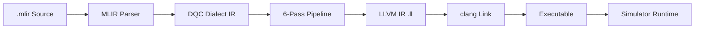
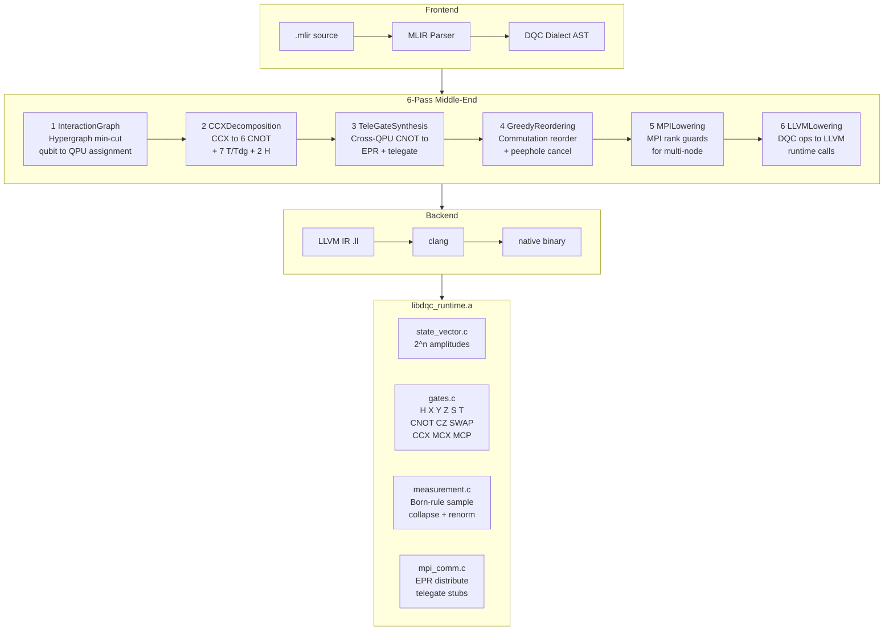
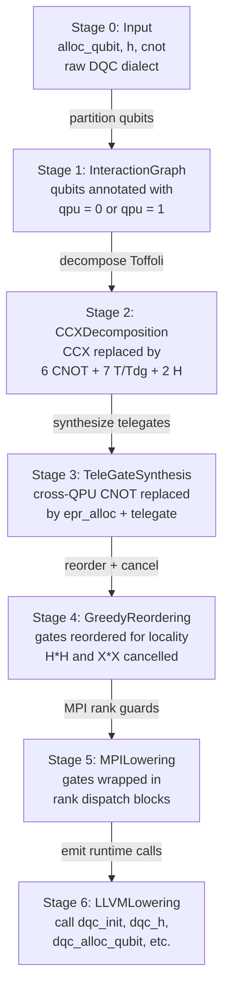
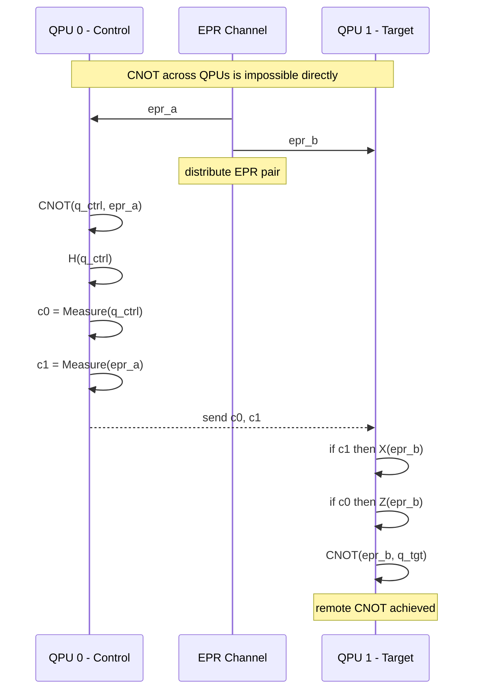
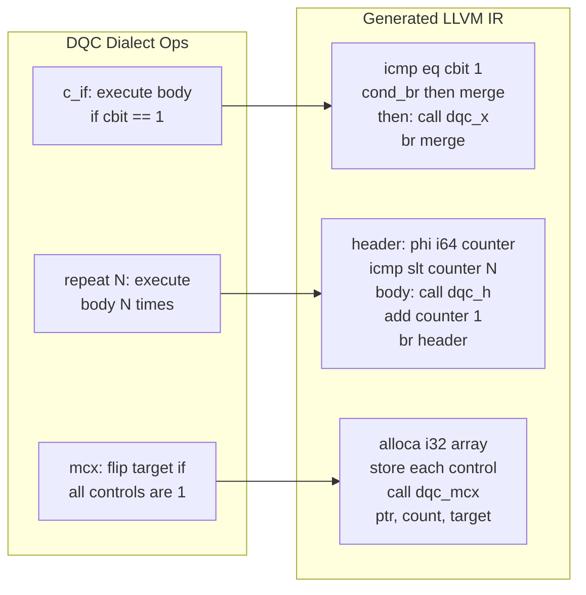
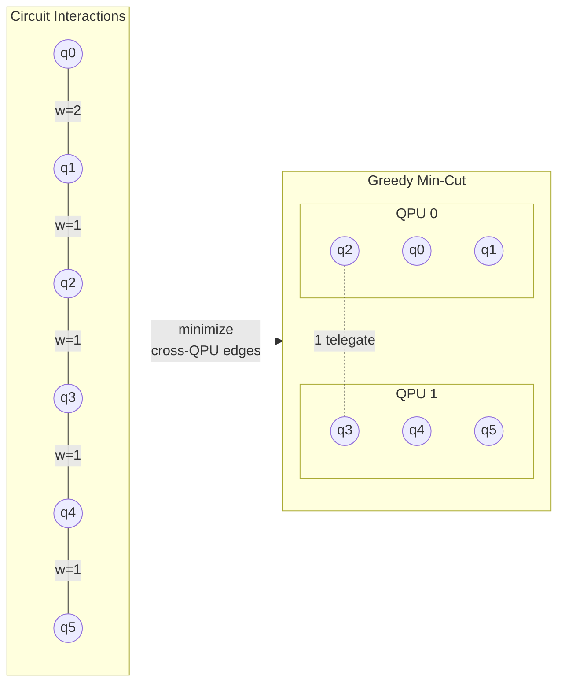
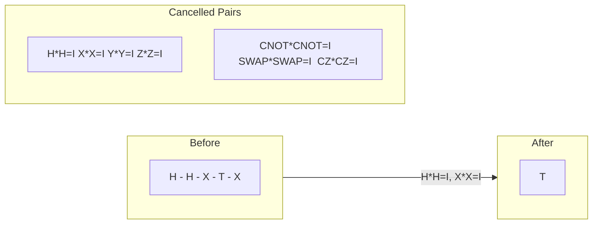
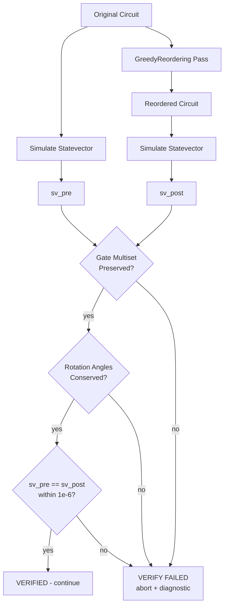
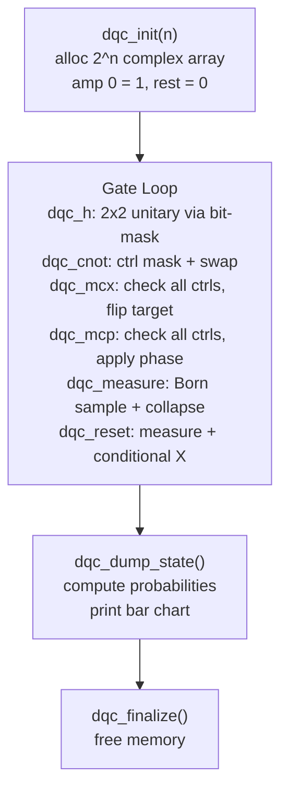

DQC — Distributed Quantum Compiler
====================================

A 6-pass quantum compiler on MLIR/LLVM that partitions circuits across QPUs, synthesizes teleportation-based remote gates over EPR channels, and lowers to native executables through statevector simulation.

Architecture
------------

### High-Level Pipeline



### System Architecture



### Progressive Lowering



### Teleportation Protocol



### LLVM Control Flow Lowering



### Hypergraph Partitioning



### Peephole Cancellation



### Verification Pipeline



### Runtime Execution



Features
--------

- **Universal Gate Set** — supports any quantum program:
  - Single-qubit: `h`, `x`, `y`, `z`, `s`, `t`, `rx`, `ry`, `rz`
  - Two-qubit: `cnot`, `cz`, `swap`
  - Three-qubit: `ccx` (Toffoli)
  - Multi-controlled: `mcx` (generalized Toffoli), `mcp` (controlled phase)
  - Measurement: `measure` with Born-rule sampling and state collapse
  - Mid-circuit reset: `reset` (measure + conditional X to restore |0>)
  - Classical feedback: `c_if` (conditionally execute gates based on measurement outcome)
  - Static loops: `repeat N { body }` for iterative algorithms
  - Barrier: `barrier` for reordering fences

- **Custom MLIR Dialects:**
  - `dqc` dialect for quantum types (`!dqc.qubit`, `!dqc.cbit`), gates, and control flow
  - `mpi` dialect for distributed communication (`distribute_epr`, `telegate_sequence`)

Writing Circuits
----------------

```mlir
module {
  func.func @my_circuit() {
    // 1. Allocate qubits
    %q0 = dqc.alloc_qubit : !dqc.qubit
    %q1 = dqc.alloc_qubit : !dqc.qubit

    // 2. Apply gates
    dqc.h %q0 : (!dqc.qubit)
    dqc.cnot %q0, %q1 : (!dqc.qubit, !dqc.qubit)

    // 3. Measure
    %c = dqc.measure %q0 : (!dqc.qubit) -> !dqc.cbit

    // 4. Classical feedback
    dqc.c_if %c {
      dqc.x %q1 : (!dqc.qubit)
    }

    // 5. Loops
    dqc.repeat 3 {
      dqc.rz %q1 0.1 : (!dqc.qubit)
    }

    return
  }
}
```

### Gate Reference

| Gate | Syntax | Description |
|------|--------|-------------|
| H | `dqc.h %q : (!dqc.qubit)` | Hadamard |
| X | `dqc.x %q : (!dqc.qubit)` | Pauli-X (bit flip) |
| Y | `dqc.y %q : (!dqc.qubit)` | Pauli-Y |
| Z | `dqc.z %q : (!dqc.qubit)` | Pauli-Z (phase flip) |
| S | `dqc.s %q : (!dqc.qubit)` | S gate (pi/2 phase) |
| T | `dqc.t %q : (!dqc.qubit)` | T gate (pi/4 phase) |
| Rx | `dqc.rx %q 1.5708 : (!dqc.qubit)` | X-rotation (radians) |
| Ry | `dqc.ry %q 0.7854 : (!dqc.qubit)` | Y-rotation (radians) |
| Rz | `dqc.rz %q 3.1416 : (!dqc.qubit)` | Z-rotation (radians) |
| CNOT | `dqc.cnot %c, %t : (!dqc.qubit, !dqc.qubit)` | Controlled-NOT |
| CZ | `dqc.cz %c, %t : (!dqc.qubit, !dqc.qubit)` | Controlled-Z |
| SWAP | `dqc.swap %a, %b : (!dqc.qubit, !dqc.qubit)` | Qubit swap |
| CCX | `dqc.ccx %c0, %c1, %t : (...)` | Toffoli |
| MCX | `dqc.mcx %c0, %c1, ..., %t : (...)` | Multi-controlled X |
| MCP | `dqc.mcp %c0, ..., %t angle : (...)` | Multi-controlled phase |
| Measure | `%c = dqc.measure %q : (!dqc.qubit) -> !dqc.cbit` | Born-rule measurement |
| Reset | `dqc.reset %q : (!dqc.qubit)` | Reset qubit to \|0> |
| c_if | `dqc.c_if %cbit { ... }` | Conditional on measurement |
| Repeat | `dqc.repeat N { ... }` | Static loop |
| Barrier | `dqc.barrier` | Reordering fence |

Project Structure
-----------------

```
dqc1/
├── include/dqc/
│   ├── DQCDialect.td          # DQC dialect TableGen definition
│   ├── MPIDialect.td          # MPI dialect TableGen definition
│   ├── DQCDialect.h           # Dialect C++ header
│   ├── DQCOps.h               # Op class declarations
│   ├── Passes.h               # Pass function declarations
│   └── *.inc                  # TableGen-generated implementations
├── lib/
│   ├── Dialect/               # DQC + MPI dialect registration
│   ├── Passes/
│   │   ├── Partitioning/      # InteractionGraphPass
│   │   ├── Synthesis/         # CCXDecomposition + TeleGateSynthesis
│   │   └── Optimization/      # GreedyReorderingPass
│   └── Lowering/              # MPILowering + LLVMLowering
├── runtime/                   # Statevector simulator (C)
├── tools/                     # dqc-compile + dqc-opt
├── demo/                      # 14 demo circuits + run.sh
├── benchmarks/                # 8 verification benchmarks
└── test/                      # LLVM Lit tests
```

Building
--------

### Prerequisites
- CMake >= 3.20
- Ninja
- LLVM/MLIR 22 (`brew install llvm` on macOS)
- Clang

### Build

```sh
cmake -G Ninja -S . -B build \
  -DMLIR_DIR=/opt/homebrew/opt/llvm/lib/cmake/mlir \
  -DLLVM_DIR=/opt/homebrew/opt/llvm/lib/cmake/llvm
cmake --build build
```

Running
-------

```sh
cd demo

./run.sh 02_bell_state              # Compile + run a circuit
./run.sh 02_bell_state --ir         # Show generated LLVM IR
./run.sh 02_bell_state --passes     # Show each pass output
./run.sh 02_bell_state --verbose    # Verbose runtime output
./run.sh --list                     # List all demo circuits
./run.sh --all                      # Run all 14 demos
```

### Compiler directly

```sh
# Compile to LLVM IR
./build/tools/dqc-compile/dqc-compile circuit.mlir -o circuit.ll

# With verification
./build/tools/dqc-compile/dqc-compile circuit.mlir --verify

# Link and run
clang circuit.ll -L build/runtime -ldqc_runtime -lm -o circuit
./circuit
```

Demo Circuits
-------------

| # | Circuit | Features Demonstrated |
|---|---------|----------------------|
| 01 | single_qubit | Hadamard, superposition |
| 02 | bell_state | Entanglement (H + CNOT) |
| 03 | ghz_state | 4-qubit GHZ state |
| 04 | measure | Mid-circuit measurement |
| 05 | rotations | Rx, Ry, Rz parametric gates |
| 06 | all_gates | Every gate in the system |
| 07 | teleportation | Quantum teleportation protocol |
| 08 | bernstein_vazirani | BV algorithm (hidden bitstring recovery) |
| 09 | qft | 4-qubit Quantum Fourier Transform |
| 10 | vqe_ansatz | Variational Quantum Eigensolver ansatz |
| 11 | conditional | Teleportation with c_if corrections |
| 12 | reset_mcx | Multi-controlled X + qubit reset |
| 13 | repeat_loop | Static loop (H^4 = I verification) |
| 14 | mcp_phase | Multi-controlled phase (CCZ kickback) |

Testing
-------

```sh
# Run all benchmarks with verification
for f in benchmarks/*.mlir; do
  ./build/tools/dqc-compile/dqc-compile "$f" --verify
done

# Lit regression tests
cd build && llvm-lit -v test/
```

Maintainer
----------

Krish Kumar Sharma — [Quantum-Blade1](https://github.com/Quantum-Blade1)
